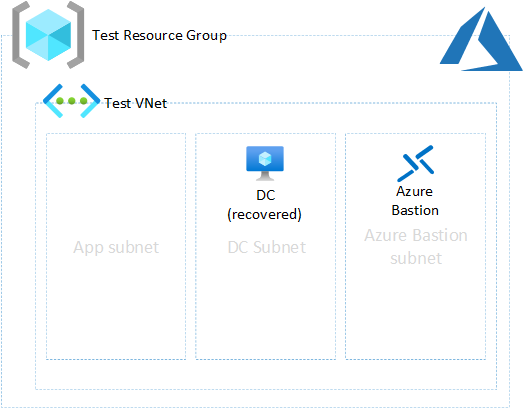

# Azure Migrate Test Environment Automation

Scripts and templates to create test environment with isolated VNet, Bastion and DC replica so you can execute Test Failover for validating migrated workloads.

Script assumes you have existing (prod) domain controller in your Azure subscription. You can use either to restore DC to isolated VNet from Azure Backup or create new VM by using managed disk Snapshots taken on existing DC.

You can run either option by configuring parameters and executing *CreateTestEnvironment.ps1* PS script.

